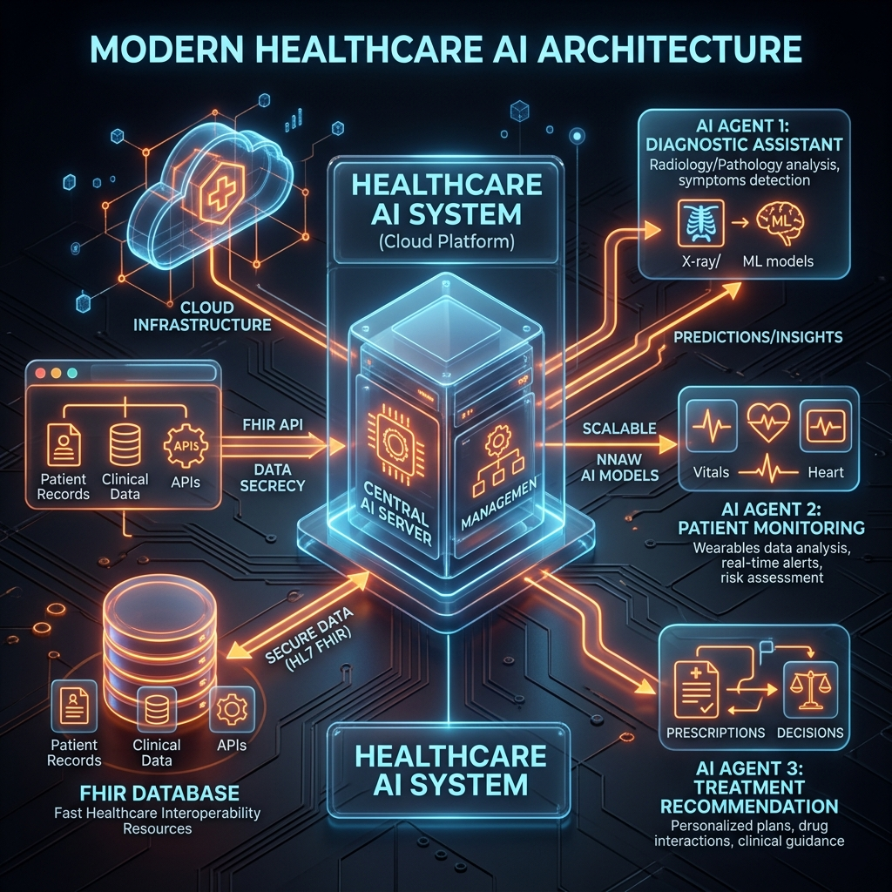
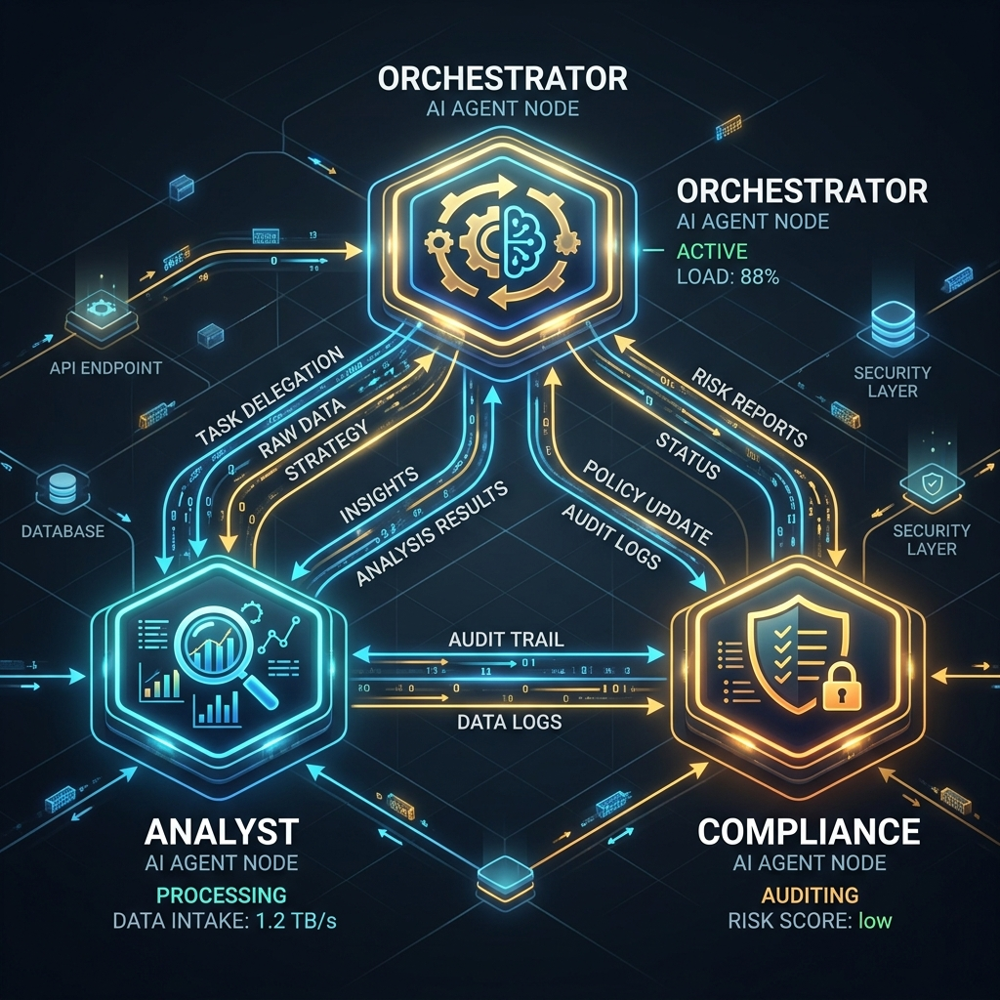
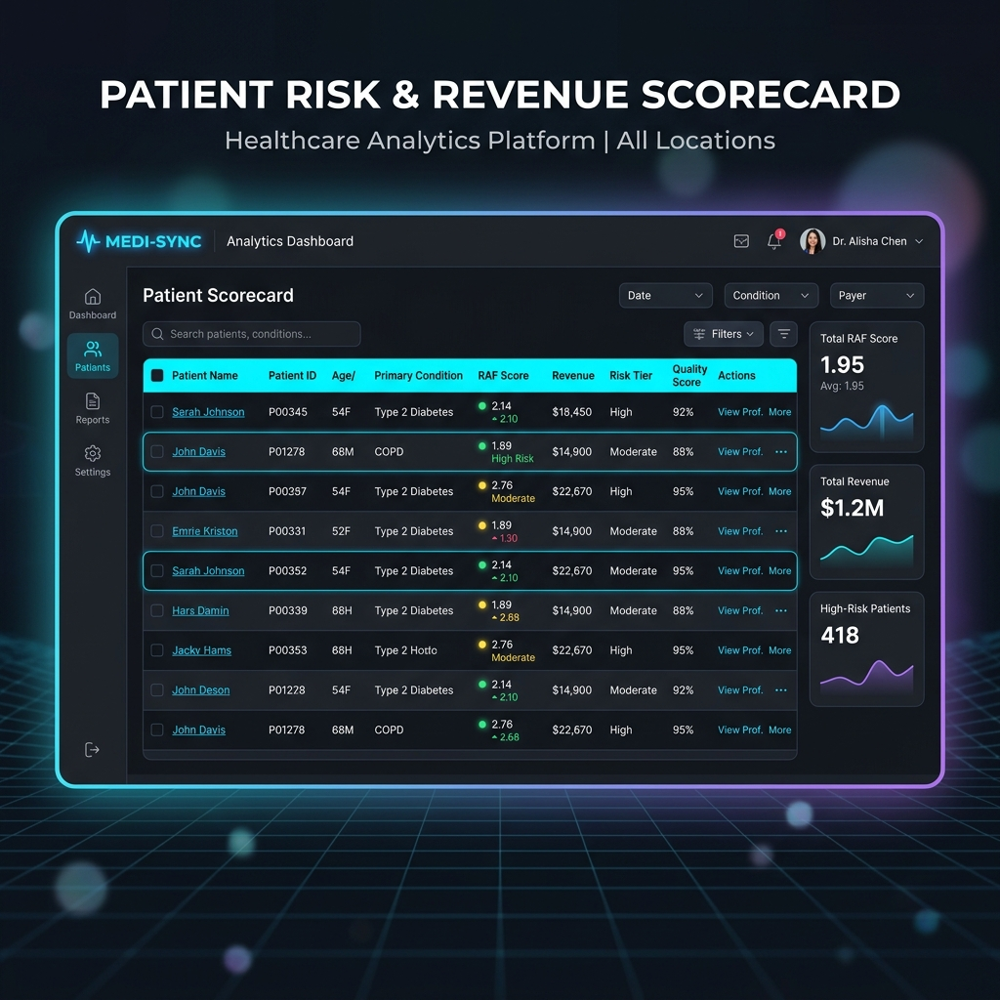
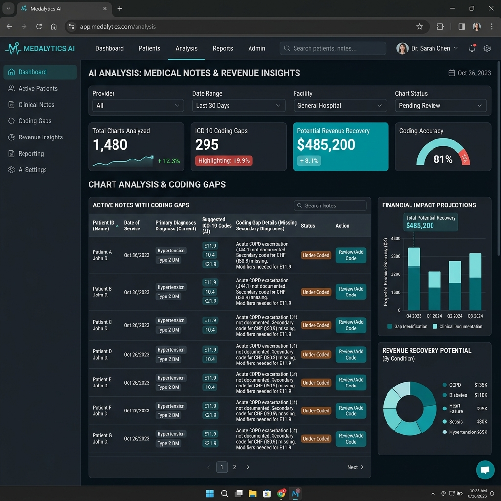
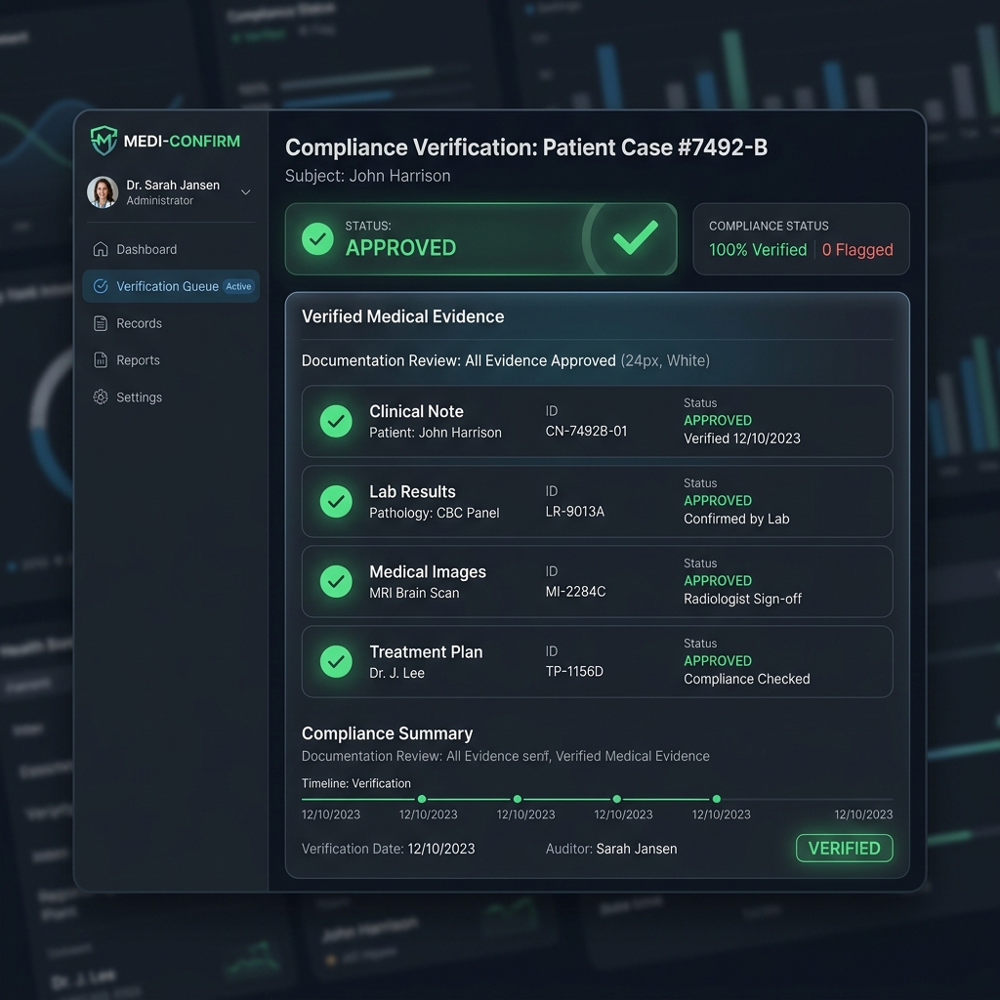
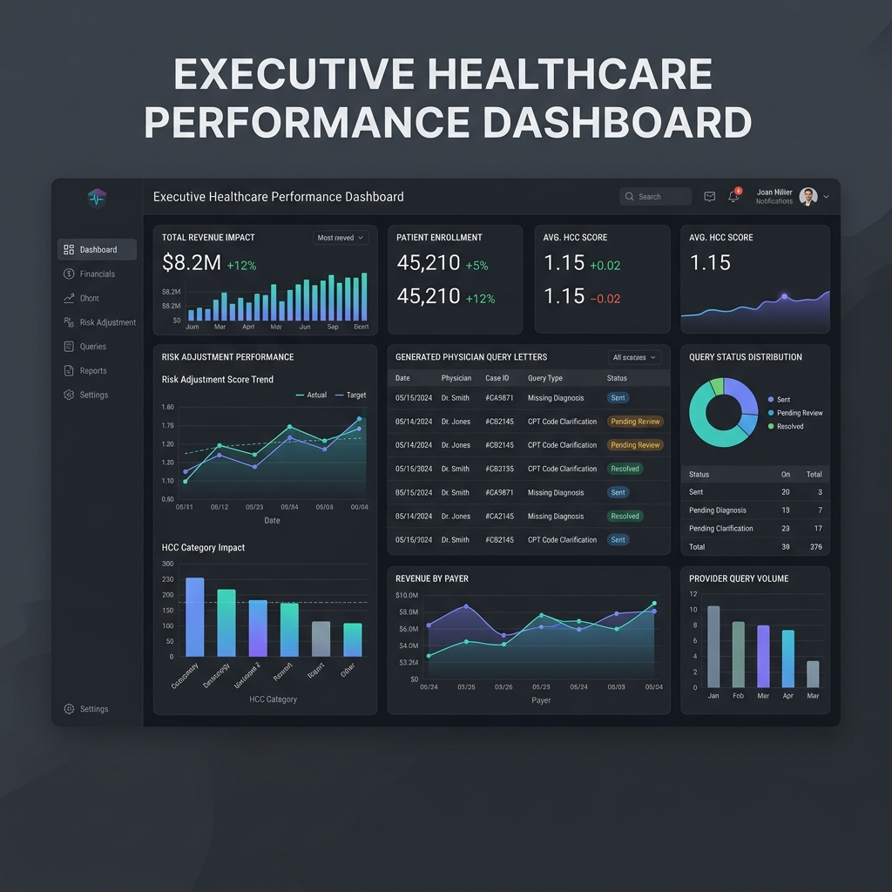

# FIRE: FHIR-Integrated Revenue Engine
*(Prompt Opinion "Agents Assemble" Hackathon Submission)*

## Executive Summary
FIRE is a deterministic, multi-agent AI pipeline that directly interfaces with FHIR R4 servers to automatically audit patient records for CMS V28 HCC coding gaps. By combining a structural MCP tool for data retrieval with three specialized AI agents, FIRE identifies undocumented clinical conditions, gets them verified against CMS MEAT standards, and calculates exact revenue recovery metrics.

**Business Model:** FIRE operates on a shared savings model. We charge minimal upfront SaaS fees, taking exactly 10% of the net new RAF revenue generated from our identified and approved coding gaps. In a representative audit of just 3 patients, the engine can recover $9,540/yr, netting FIRE $954 in recurring value.

## The Technology Stack
* **FastAPI + FastMCP**: Serves the `audit_v28_cohort` MCP tool.
* **SHARP Protocol Middleware**: Intercepts `X-FHIR-Server-URL` and authentication headers from the Prompt Opinion platform, proving deep integration with the platform's standard capabilities.
* **Live FHIR R4 Integration**: We do not use fake mock data for the demo. FIRE queries a live, public HAPI FHIR server. You can view one of our exact hydrated patients (Tamara Williams) live on the network here:
  [View Real FHIR Patient Resource](https://hapi.fhir.org/baseR4/Patient/132026010)



## The Multi-Agent Topology
FIRE leverages the "Agents Assemble" framework by orchestrating three distinct personas in a strict data-handoff topology:

1. **Clinical Orchestrator (Manager)**: Runs the MCP tool `audit_v28_cohort` to fetch FHIR data. Crucially, it acts as a pure data pipeline, serializing the raw JSON array and handing it directly to the analyst agent to prevent LLM context fragmentation.
2. **HCC Risk Navigator (Analyst)**: A sub-agent dedicated exclusively to cross-referencing `clinical_notes_text` against the CMS V28 HCC dictionary. It identifies the gaps and calculates the RAF math (Current vs. Projected).
3. **Compliance Reviewer (Auditor)**: A final checkpoint agent that verifies the proposed ICD-10 codes against the exact text quotes extracted from the notes to ensure CMS MEAT (Monitor, Evaluate, Assess, Treat) documentation standards are met before physician queries are drafted.



## The Demo Execution (Step-by-Step)
To guarantee flawless, deterministic execution without LLM context overload, the demonstration is run through a strict 4-step conversational hand-off. The judges can easily reproduce this exact output.

### Step 1: Cohort Sweep
**Prompt:**
```text
Please run the audit_v28_cohort tool to sweep a block of patients. Display the baseline cohort scorecard to me so I can see who needs CDI review.
```
**Output Highlights:**

*(Shows 6 patients fetched from FHIR, highlighting Tamara, Richard, and Maria as having pending gap analysis due to attached clinical notes).*

### Step 2: Risk Analysis
**Prompt:**
```text
Now, you must consult the 'HCC Risk Navigator' agent. You MUST pass the ENTIRE raw JSON array from the tool output to the Risk Navigator in ONE SINGLE message. Do not summarize the data or send multiple messages. Ask the Risk Navigator to analyze the clinical_notes_text against the hcc_reference_v28 to identify high-value coding gaps for Tamara, Richard, and Maria, and return the exact gap descriptions, projected_raf, and Revenue Impact calculations.
```
**Output Highlights:**

*(Successfully identifies E11.40 for Tamara, J44.1 for Richard, and N18.4 for Maria with exact RAF Deltas).*

### Step 3: Compliance Verification
**Prompt:**
```text
Excellent. Now consult the 'Compliance Reviewer' agent in ONE SINGLE message. Pass it the exact clinical evidence quotes and proposed ICD-10 codes returned by the Risk Navigator. Ask the Compliance Reviewer to verify the evidence against CMS MEAT standards and return the compliance verdicts.
```
**Output Highlights:**

*(All three findings verified and 🟢 APPROVED).*

### Step 4: The 5Ts Deliverable
**Prompt:**
```text
Finally, compile everything into a complete 5Ts deliverable. 

CRITICAL INSTRUCTIONS:
- Table Math: You must explicitly list the current_raf (e.g., 0.104 or 0.000). Add the gap's RAF weight to get the projected_raf, and calculate Revenue Impact at $10,000 per 1.0 RAF delta. 
- Templates: Generate distinct Physician Query Drafts for EACH approved gap. Make up an attending physician's name (e.g., Dr. Smith), but ensure the exact Patient Name and exact clinical condition are explicitly written out.
```
**Output Highlights:**

*(Final report yields $9,540 in immediate revenue impact, fully customized Physician Query letters, and zero LLM hallucinations).*

## Market Analysis & Revenue Projections
To understand the financial scale of this technology, here is a highly conservative market analysis for deploying FIRE at a typical mid-sized regional hospital:

**Conservative Assumptions:**
* **Medicare Advantage Panel**: 10,000 patients.
* **Gap Prevalence**: Only 5% of patients (500) have an undocumented HCC gap buried in their unstructured clinical notes.
* **Average Gap Value**: A minor +0.200 RAF increase per gap (approx. $2,000/yr per patient).

**Hospital Financial Impact:**
* 500 patients × $2,000 = **$1,000,000 in recovered annual revenue**.
* Cost to hospital: $0 upfront. No new clinical documentation integrity (CDI) headcount required.

**FIRE Business Model (10% Shared Savings):**
* $1,000,000 × 10% = **$100,000 Annual Recurring Revenue (ARR)** for FIRE per hospital.
* Capturing just 10 mid-sized hospitals yields a $1M ARR SaaS business with near-zero marginal cost, as the deterministic multi-agent pipeline operates entirely autonomously.

## Glossary of Terms
To help judges unfamiliar with healthcare Revenue Cycle Management (RCM) understand the exact value of this pipeline, here are the key terms used:

* **FIRE**: FHIR-Integrated Revenue Engine. The name of our project and MCP backend server.
* **FHIR (Fast Healthcare Interoperability Resources)**: The modern, global API standard for exchanging electronic health records (EHR).
* **ICD-10 Codes**: The universal alphanumeric codes used by clinicians to classify every disease, injury, and symptom.
* **HCC (Hierarchical Condition Category)**: A risk-adjustment model used by Medicare. Not all ICD-10 codes map to an HCC. HCC codes carry a specific "weight" that translates directly to higher Medicare reimbursement for treating sicker patients.
* **RAF (Risk Adjustment Factor)**: A patient's cumulative health score, calculated by adding up the weights of all their active HCC codes. A higher RAF score means the hospital gets paid more annually to manage that patient's complex care. ($10,000 per 1.0 RAF).
* **CMS V28**: The newest, much stricter version of the Medicare HCC scoring model. In V28, generic diagnoses are now worth $0. Hospitals are currently losing millions of dollars in revenue because their documentation isn't specific enough to meet V28's requirements.
* **CMS MEAT Standards**: To legally claim an HCC code, a doctor's clinical note must explicitly show they are **M**onitoring, **E**valuating, **A**ssessing, or **T**reating the condition. Our Compliance Reviewer agent specifically verifies this to prevent fraud.
