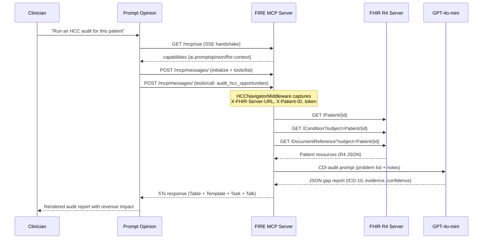

# 🔥 FIRE — FHIR-Integrated Revenue Engine

> **Agents Assemble Hackathon** · Prompt Opinion Platform · May 2026

FIRE is a production-grade MCP server that audits Medicare Advantage patient charts for **V28 HCC coding gaps** — conditions clinically documented in notes but missing from the coded problem list. Each uncaptured HCC code represents roughly **$10,000 in lost annual revenue** per patient. FIRE finds them, quantifies the loss, and generates the physician query to fix it.

---

## The Problem

The CMS transition from HCC Model V24 → **V28** (completed 2026) made "unspecified" diagnosis codes like `E11.9` (Type 2 Diabetes, unspecified) worth **zero** in risk adjustment. Providers who coded correctly under V24 are now losing reimbursement unless their charts document the specificity that V28 demands — e.g., `E11.40` (T2DM with diabetic neuropathy). That specificity is often buried in the unstructured note. A physician wrote "bilateral burning and numbness in feet, started Gabapentin" — but never updated the problem list code. FIRE catches this.

Industry estimate: **$100,000–$500,000 in annual RAF revenue leakage** per 50-patient Medicare Advantage panel that hasn't been audited.

---

## What It Does

FIRE exposes **two MCP tools** to the Prompt Opinion platform:

### `audit_hcc_opportunities(patient_id)`
Single-patient chart audit. Given a FHIR patient ID:
1. Fetches the patient's **Conditions** and **DocumentReferences** from the FHIR R4 server
2. Computes the current RAF score from the coded ICD-10 problem list (CMS HCC V28 model)
3. Sends the unstructured clinical notes to **GPT-4o-mini** with a CDI specialist system prompt
4. Identifies HCC coding gaps — conditions documented in notes but not on the problem list
5. Returns the **5Ts deliverable framework** (see below)

### `audit_v28_cohort(max_patients=5)`
Cohort-level sweep. Fetches up to N patients from the FHIR server, audits each, and returns a **cohort RAF Gap Scorecard** sorted by estimated revenue recovery. Designed for population health managers and RCM directors who need a daily gap report across their panel.

---

## The 5Ts Output Framework

Every audit returns four structured deliverables:

| Deliverable | What It Is |
|---|---|
| **Table** | Markdown RAF Gap Scorecard — ICD-10 gap, HCC code, confidence, RAF delta, estimated annual revenue impact in dollars |
| **Template** | Pre-filled physician query letter — compliant CDI query citing the evidence quote from the note, the suggested code, and the V28 rationale |
| **Task** | JSON RCM workflow ticket — priority, assignee, due date, gap summary — ready to POST to your task management system |
| **Talk** | Plain-English consultation summary — what the AI found, in language a CDI specialist can read in 10 seconds |

---

## Architecture

```
Prompt Opinion Platform (app.promptopinion.ai)
    │
    │  MCP/SSE (JSON-RPC over HTTP)
    │  SHARP headers: X-FHIR-Server-URL, X-FHIR-Access-Token, X-Patient-ID
    ▼
┌─────────────────────────────────────────────────────┐
│  FIRE MCP Server  (FastAPI + FastMCP)               │
│                                                     │
│  HCCNavigatorMiddleware (pure ASGI)                 │
│  ├── Logs agent identity + origin                   │
│  └── Captures all SHARP headers → ContextVar        │
│                                                     │
│  Tools                                              │
│  ├── audit_hcc_opportunities(patient_id)            │
│  └── audit_v28_cohort(max_patients)                 │
│                                                     │
│  _fetch_fhir_patient_context()                      │
│  ├── GET /Patient/{id}                              │
│  ├── GET /Condition?subject=Patient/{id}            │
│  └── GET /DocumentReference?subject=Patient/{id}   │
│                                                     │
│  audit_hcc_gaps()  ←  GPT-4o-mini CDI analysis     │
│  format_5ts()      ←  Table / Template / Task / Talk│
└─────────────────────────────────────────────────────┘
    │
    │  FHIR R4 API (Bearer token auth)
    ▼
FHIR Server
(Prompt Opinion FHIR proxy  OR  hapi.fhir.org/baseR4 fallback)
```

### SHARP Protocol Compliance

The server implements Prompt Opinion's **SHARP Extension** specification:

- **`initialize` handshake**: Declares `ai.promptopinion/fhir-context` in `capabilities.extensions` with required FHIR scopes
- **FHIR scopes requested**: `patient/Patient.rs`, `patient/Condition.rs`, `patient/DocumentReference.rs`, `offline_access`
- **Header capture**: `X-FHIR-Server-URL`, `X-FHIR-Access-Token`, `X-Patient-ID`, `X-FHIR-Refresh-Token`, `X-FHIR-Refresh-Url` — all captured via a **pure ASGI middleware** (not `BaseHTTPMiddleware`, which breaks SSE streaming)
- **FHIR-first, mock fallback**: Tools try the real FHIR server from SHARP context first; falls back to the seeded mock EHR for local testing

### FHIR Server

Primary: **Po's workspace FHIR proxy** (`https://app.promptopinion.ai/api/workspaces/{id}/fhir`)
Fallback (dev/test): **HAPI FHIR public demo server** (`https://hapi.fhir.org/baseR4`) — R4, open, 43,000+ patients

---

## System Flow



---

## Project Structure

```
FIRE/
├── src/
│   ├── server.py          # FastAPI + FastMCP MCP server (main entry point)
│   ├── hcc_engine.py      # RAF calculator, LLM gap detector, 5Ts formatter
│   ├── models.py          # SQLAlchemy ORM (Patient, Condition, ClinicalNote)
│   └── database.py        # SQLite engine + session factory
├── scripts/
│   └── seed_db.py         # Seeds mock EHR with Tamara Williams demo patient
├── tests/
│   ├── test_hcc_auditor.py   # Unit tests: RAF calc, LLM gap detection, output shape
│   ├── test_mcp_server.py    # Integration tests: REST endpoints + full SSE round-trip
│   ├── test_seed_db.py       # DB seed validation
│   └── test_wait_utils.py    # Async polling utilities
├── docs/
│   ├── promptopinion.md      # Prompt Opinion platform spec (SHARP, A2A, MCP)
│   ├── hackathon_details.md  # Submission requirements
│   └── next_prompt.txt       # Agent execution instructions
└── pyproject.toml
```

---

## Endpoints

| Method | Path | Description |
|---|---|---|
| `GET` | `/health` | Liveness check → `{"status": "ok"}` |
| `GET` | `/mcp/sse` | MCP SSE stream — Prompt Opinion connects here |
| `POST` | `/mcp/messages/` | MCP JSON-RPC bus — tool calls arrive here |
| `POST` | `/tools/audit_hcc_opportunities` | REST wrapper for direct curl testing |
| `GET` | `/docs` | FastAPI Swagger UI |

---

## Local Setup

### Prerequisites
- Python 3.10+
- OpenAI API key
- ngrok (to expose the server to Prompt Opinion)

### Step 0: Environment Configuration

Create `.env` in the project root:

```env
OPENAI_API_KEY=sk-...
PROMPTOPINION_API_KEY=...
LANGCHAIN_API_KEY=...          # optional, for tracing
LANGCHAIN_TRACING_V2=true      # optional
```

### Step 1: Install

```bash
git clone https://github.com/vjb/FIRE.git
cd FIRE

python -m venv venv
venv\Scripts\activate          # Windows
# source venv/bin/activate    # macOS/Linux

pip install -e ".[dev]"
```

### Step 2: Seed the Mock EHR

```bash
python scripts/seed_db.py
```

This creates `data/mock_ehr.sqlite` with a seeded Medicare Advantage patient (Tamara Williams, DOB 1956-03-12) including:
- Coded condition: `E11.9` (T2DM unspecified, HCC 19, RAF 0.104)
- Clinical note documenting bilateral foot neuropathy + Gabapentin → gap: `E11.40` (HCC 18, RAF +0.302 = **+$3,020/yr**)

### Step 3: Run the Server

```bash
python -m uvicorn src.server:app --host 0.0.0.0 --port 8000 --reload
```

### Step 4: Expose via ngrok

```bash
ngrok http 8000
```

Copy the `https://` URL. In Prompt Opinion → Configuration → MCP Servers → paste `<ngrok-url>/mcp/sse`.

### Step 5: Run Tests

```bash
venv\Scripts\python.exe -m pytest tests/ -v
```

Expected: **56/56 PASS**

---

## Testing

The test suite validates three layers:

| Layer | File | What it tests |
|---|---|---|
| Unit | `test_hcc_auditor.py` | RAF computation, LLM gap detection (mocked), output schema |
| Integration | `test_mcp_server.py` | REST endpoints, SSE transport, full JSON-RPC round-trip |
| DB | `test_seed_db.py` | Seed integrity — Tamara's conditions, notes, FHIR R4 JSON validity |

The SSE round-trip test (`test_jsonrpc_tools_list_via_sse`) runs a full **two-connection MCP session** against a live uvicorn subprocess — GET /mcp/sse held open while POST /mcp/messages/ sends `initialize` → `notifications/initialized` → `tools/list`.

---

## CMS HCC V28 Reference

The engine uses a hardcoded subset of the CMS V28 RAF weight table (source: 2024 CMS HCC Risk Adjustment Model):

| ICD-10 | HCC | Condition | RAF Weight |
|---|---|---|---|
| `E11.9` | 19 | T2DM without complications | 0.104 |
| `E11.40` | 18 | T2DM with diabetic neuropathy | 0.302 |
| `I50.9` | 85 | Heart failure, unspecified | 0.331 |
| `N18.3` | 137 | CKD Stage 3 | 0.289 |
| `N18.4` | 136 | CKD Stage 4 | 0.421 |
| `J44.1` | 111 | COPD with exacerbation | 0.335 |
| `F32.9` | 59 | Major depressive disorder | 0.309 |
| `G40.909` | 79 | Epilepsy, unspecified | 0.612 |

Revenue estimate uses the industry-standard **$10,000 per RAF point** for Medicare Advantage plans.

---

## Hackathon Submission

- **Competition**: Prompt Opinion "Agents Assemble" Hackathon
- **Deadline**: May 11, 2026
- **Platform**: [app.promptopinion.ai](https://app.promptopinion.ai)
- **Category**: Healthcare AI / Revenue Cycle Management
- **Key differentiator**: First MCP server to implement the full Prompt Opinion SHARP Extension spec with live FHIR R4 server integration and V28-specific revenue gap quantification
