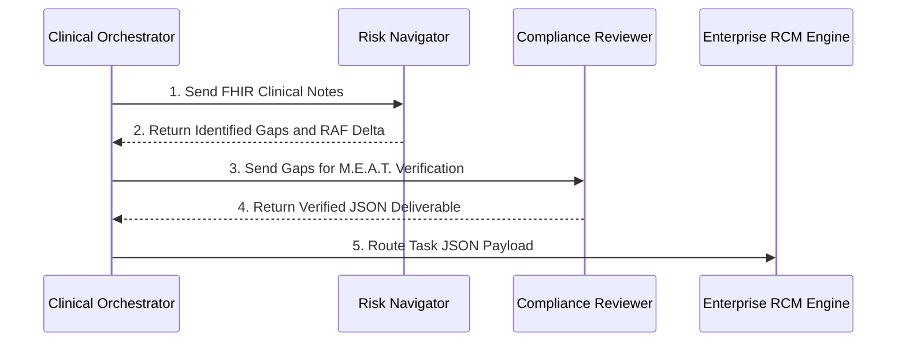
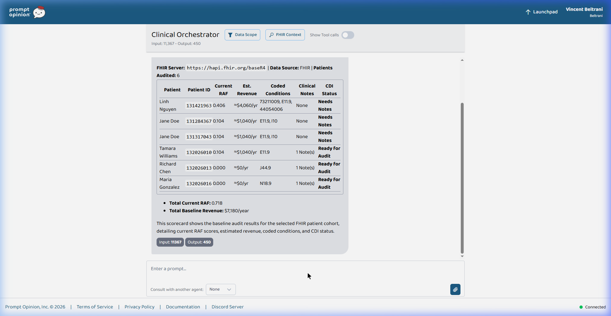
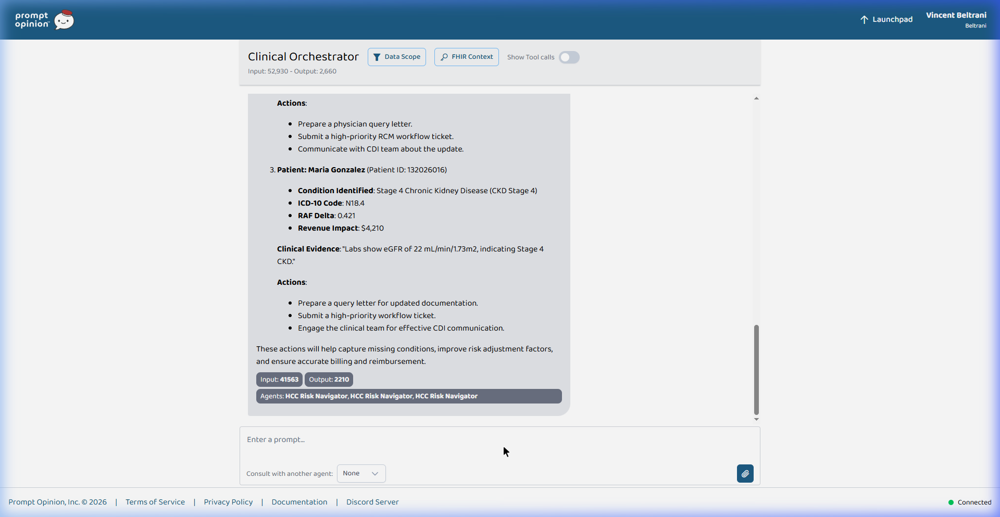
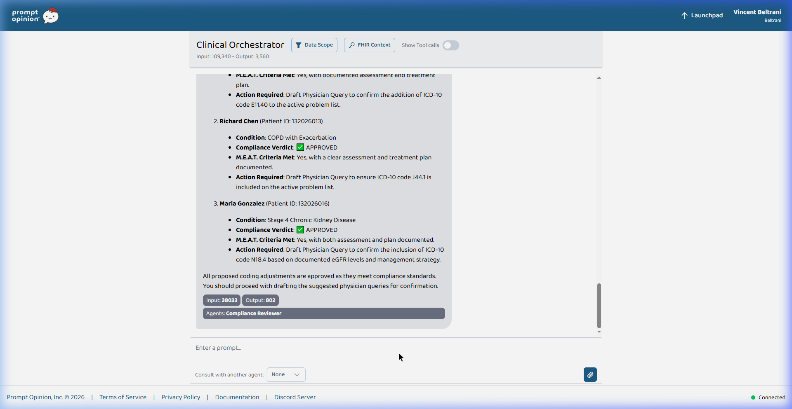
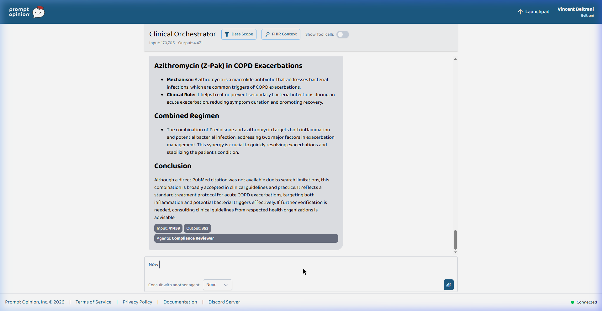

# FIRE: FHIR-Integrated Revenue Engine

## Architecture Overview
FIRE is a multi-agent system that interfaces with FHIR R4 servers to audit patient records for CMS V28 HCC coding gaps. The system utilizes an MCP tool for data retrieval and three agents to identify clinical conditions, verify them against CMS M.E.A.T. standards, and calculate revenue metrics.

## System Integrations
The FIRE MCP Server and Agents are deployed on the Prompt Opinion platform:
* [FIRE MCP Tool](https://app.promptopinion.ai/marketplace/mcp/019d39ef-c21c-703d-a526-e8bcaf8b4fb8)
* [HCC Risk Navigator Agent](https://app.promptopinion.ai/marketplace/agent/019d39f2-f707-719a-b3f1-396b997b5f47)
* [Compliance Reviewer Agent](https://app.promptopinion.ai/marketplace/agent/019d39f3-f6da-779b-b85a-ec474cfde56a)

## Technology Stack
* **FHIR R4 Integration**: FIRE queries a public HAPI FHIR server. A test patient record is available here:
  * [View FHIR Patient Resource](https://hapi.fhir.org/baseR4/Patient/132026010)
  * [View FHIR Clinical Note (Base64 Encoded DocumentReference)](https://hapi.fhir.org/baseR4/DocumentReference?subject=Patient/132026010)
* **Cloud Deployment**: The MCP backend is deployed as a service on Render. The active endpoints are:
  * [Live MCP Server SSE Endpoint](https://fire-mcp-backend.onrender.com/mcp/sse)
  * [Interactive Swagger UI (/docs)](https://fire-mcp-backend.onrender.com/docs)
  * [OpenAPI Schema (/openapi.json)](https://fire-mcp-backend.onrender.com/openapi.json)
* **FastAPI and FastMCP**: Serves the `audit_v28_cohort` MCP tool.
* **SHARP Protocol Middleware and HTI-1 Interoperability**: Intercepts `X-FHIR-Server-URL` and authentication headers. FIRE adheres to the SHARP extension specifications and FHIR standards for EHR interoperability.

## Agent Topology
FIRE orchestrates three distinct agents in a sequential data-handoff topology:

1. **Clinical Orchestrator**: Executes the MCP tool `audit_v28_cohort` to fetch FHIR data. It functions as a data pipeline, managing the initial handoff to sub-agents and routing the final JSON payload to the enterprise RCM system (e.g., Jira, Epic).
2. **HCC Risk Navigator**: A sub-agent that cross-references `clinical_notes_text` against the CMS V28 HCC dictionary. It identifies documentation gaps and calculates the RAF delta. It queries a vectorstore containing the ICD-10 MS-DRG Version 43.1 guidelines to retrieve diagnostic codes.
3. **Compliance Reviewer**: A validation agent that acts as a compliance gatekeeper. It does not have direct database or FHIR access. It verifies that proposed codes meet CMS M.E.A.T. (Monitor, Evaluate, Assess, Treat) criteria based on the clinical notes. It utilizes a PubMed integration to cross-reference prescribed treatments against medical literature.



### Agent Configurations
The agent system prompts for the Orchestrator, Risk Navigator, and Compliance Reviewer are documented here:
[View Agent System Prompts (`docs/prompts.md`)](docs/prompts.md)

## Execution Pipeline
Note: This pipeline can be automated to schedule tasks in an enterprise workflow system. For demonstration purposes, it is executed sequentially to verify outputs.

### Step 1: Cohort Triage and Baseline Scorecard
The system calculates the current value of each patient's coded conditions and scans the FHIR records to identify patients with unreviewed clinical notes.

**Prompt:**
```text
Run a baseline audit on our newest FHIR patient cohort and show me the scorecard.
```

### Step 2: Risk Analysis
The Risk Navigator agent cross-references the retrieved clinical text against the CMS V28 dictionary to identify hidden coding gaps.

**Prompt:**
```text
Run the HCC gap analysis audit on all patients marked ready for audit and list them.
```



### Step 3: RAF Impact Calculation
The system calculates the exact cumulative Risk Adjustment Factor (RAF) delta across the cohort and projects the corresponding financial impact.

**Prompt:**
```text
so whats the total raf increase and revenue impact potential?
```



### Step 4: Compliance Verification
The Compliance Reviewer verifies the proposed diagnostic codes against CMS M.E.A.T. criteria using a native PubMed integration to validate treatment protocols.

**Prompt:**
```text
check with compliance
```

### Step 5: System Integration and Workflow Hand-Off
The Orchestrator generates a structured JSON payload containing the verified clinical data and compliance decisions for routing into the hospital's RCM engine.

**Prompt:**
```text
write the json to generate the task in epic in hcls format assign dates two days from now and assign to dr. smith
```



### Step 6: Advanced PubMed Reasoning (Optional)
The Orchestrator can route complex diagnostic validation requests to the Compliance Reviewer to deeply analyze treatment mechanics using PubMed.

**Prompt:**
```text
Ask the Compliance Reviewer to provide a deep-dive explanation of the PubMed medical literature supporting the treatment plan for Richard Chen.
```



## Core Implementation Files

| File | Core Purpose | Prompt Opinion Integration Proof |
|------|--------------|--------------------------------|
| [`src/server.py`](src/server.py) | FastMCP Server and Auth | **[Capability Injection (L413-L431)](src/server.py#L413-L431):** Extends the FastMCP initialization options to register the `ai.promptopinion/fhir-context` capability. This authenticates and processes Prompt Opinion's SHARP headers and dynamic FHIR context. |
| [`src/hcc_engine.py`](src/hcc_engine.py) | Baseline Calculator | **[Raw Context Handoff (L180-L208)](src/hcc_engine.py#L180-L208):** Calculates the baseline mathematically using CMS V28 maps, and packages the raw `clinical_notes_text` array for the Prompt Opinion LLM agent. |

## Glossary of Terms
* **FIRE**: FHIR-Integrated Revenue Engine.
* **FHIR (Fast Healthcare Interoperability Resources)**: API standard for exchanging electronic health records.
* **ICD-10 Codes**: Alphanumeric codes used to classify diseases, injuries, and symptoms.
* **HCC (Hierarchical Condition Category)**: A risk-adjustment model used by Medicare.
* **RAF (Risk Adjustment Factor)**: A patient's cumulative health score, calculated by summing the weights of active HCC codes.
* **CMS V28**: The current version of the Medicare HCC scoring model.
* **CMS M.E.A.T. Standards**: Criteria requiring clinical notes to demonstrate Monitoring, Evaluating, Assessing, or Treating a condition.

## Phase 2
* **Event-Driven Architecture**: Subscribing to live `DocumentReference` creation events via webhooks for automated execution.
* **Scope of Analysis**: Incorporating standard CPT codes for E&M Leveling and SDOH Z-codes.
* **EHR Write-Back**: Implementing a direct closed-loop SMART on FHIR POST request to the clinician's inbox.
