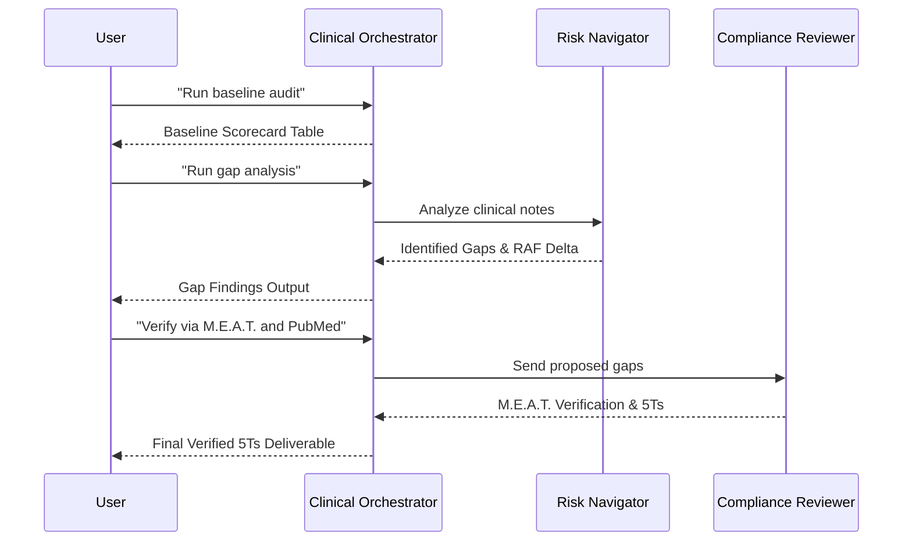

# FIRE: FHIR-Integrated Revenue Engine
*(Agents Assemble Hackathon Submission)*

[](https://youtube.com/watch?v=PLACEHOLDER)

## Executive Summary
FIRE is a deterministic, multi-agent AI pipeline that directly interfaces with FHIR R4 servers to automatically audit patient records for CMS V28 HCC coding gaps. By combining a structural MCP tool for data retrieval with three specialized AI agents, FIRE identifies undocumented clinical conditions, gets them verified against CMS MEAT standards, and calculates exact revenue recovery metrics.

**Business Model:** FIRE will operate on a shared savings model. We charge minimal upfront SaaS fees, taking exactly 10% of the net new RAF revenue generated from our identified and approved coding gaps. This perfectly aligns our incentives with the hospital's financial outcomes.

## Marketplace Integrations
You can view our live production deployments (the FIRE MCP Server and all three Agents) directly on the Prompt Opinion Marketplace:

* [**FIRE MCP Tool**](https://app.promptopinion.ai/marketplace/mcp/019d39ef-c21c-703d-a526-e8bcaf8b4fb8)
* [**HCC Risk Navigator Agent**](https://app.promptopinion.ai/marketplace/agent/019d39f2-f707-719a-b3f1-396b997b5f47)
* [**Compliance Reviewer Agent**](https://app.promptopinion.ai/marketplace/agent/019d39f3-f6da-779b-b85a-ec474cfde56a)

## The Technology Stack
* **Live FHIR R4 Integration**: FIRE queries a live, public HAPI FHIR server. You can view one of the exact hydrated patients (Tamara Williams) live on the network here:
  * [View FHIR Patient Resource](https://hapi.fhir.org/baseR4/Patient/132026010)
  * [View FHIR Clinical Note (Base64 Encoded DocumentReference)](https://hapi.fhir.org/baseR4/DocumentReference?subject=Patient/132026010)
* **Render Cloud Deployment**: The MCP backend is permanently deployed as a high-availability cloud service on Render. To verify the legitimacy of this live deployment, you can explore the active endpoints:
  * [Live MCP Server SSE Endpoint](https://fire-mcp-backend.onrender.com/mcp/sse)
  * [Interactive Swagger UI (/docs)](https://fire-mcp-backend.onrender.com/docs)
  * [OpenAPI Schema (/openapi.json)](https://fire-mcp-backend.onrender.com/openapi.json)
* **FastAPI + FastMCP**: Serves the `audit_v28_cohort` MCP tool.
* **SHARP Protocol Middleware & HTI-1 Interoperability**: Intercepts `X-FHIR-Server-URL` and authentication headers. By using the SHARP extension specs and FHIR standards, FIRE is fully compatible with **Darena Health** and HTI-1 mandates, making it capable of plugging instantly into any compliant EHR connected to the platform.

## The Multi-Agent Topology
FIRE leverages the "Agents Assemble" framework by orchestrating three distinct personas in a strict data-handoff topology:

1. **Clinical Orchestrator (Manager)**: Runs the MCP tool `audit_v28_cohort` to fetch FHIR data. Crucially, it acts as a pure data pipeline, serializing the raw JSON array and handing it directly to the analyst agent to prevent LLM context fragmentation.
2. **HCC Risk Navigator (Analyst)**: A sub-agent dedicated exclusively to cross-referencing `clinical_notes_text` against the CMS V28 HCC dictionary. It identifies the gaps and calculates the RAF math (Current vs. Projected). It has native vectorstore access to the official ICD-10 MS-DRG Version 43.1 guidelines to pull precise diagnostic codes without hallucinating.
3. **Compliance Reviewer (The Zero-Trust Firewall)**: A final checkpoint agent that acts as a zero-trust gatekeeper. It does not have direct database or FHIR access. Its sole purpose is to prevent fraud by verifying that all proposed codes are backed by strict CMS M.E.A.T. (Monitor, Evaluate, Assess, Treat) criteria found in the clinical notes. It is grounded via a native PubMed integration, allowing it to cross-reference prescribed treatments against established medical literature to validate the clinical care.



### The Agentic Prompts
All the exact agent system prompts (Orchestrator, Risk Navigator, Compliance Reviewer) that run this architecture natively on the Prompt Opinion platform have been documented here:
[View Agent System Prompts (`docs/prompts.md`)](docs/prompts.md)

### The Execution Pipeline (Step-by-Step)
> **Note:** This pipeline can be entirely automated—from reading the notes all the way to scheduling tasks in an enterprise workflow system (e.g., Jira, Epic Workqueues, or ServiceNow). For this demonstration, we are running step-by-step in interactive discovery mode to showcase how the FIRE tool works under the hood. In practice, the final 5Ts deliverable would automatically route a ticket into the hospital's RCM engine.

#### Step 1: Cohort Triage & Baseline Scorecard
To prioritize the clinical documentation workflow, the engine first establishes a financial baseline. It calculates the current value of each patient's coded conditions and scans the FHIR records to triage the queue, flagging exactly who has unreviewed unstructured clinical notes hiding potential lost revenue.

**Prompt:**
```text
Run a baseline audit on our newest FHIR patient cohort and show me the scorecard. I need to see the current RAF value of the group and identify exactly which patients have clinical notes attached that are ready for gap analysis.
```
**Output Highlights:**
<!-- Insert Step 1 Screenshot Here -->
*(Shows 6 patients fetched from FHIR, highlighting Tamara, Richard, and Maria as having pending gap analysis due to attached clinical notes).*

#### Step 2: Deterministic Risk Analysis
**Prompt:**
```text
Run the HCC gap analysis audits on the patients flagged as 'Ready for Audit'. I need to see the exact gap descriptions, the vectorstore citations proving the codes, and the projected revenue impact.
```
**Output Highlights:**
<!-- Insert Step 2 Screenshot Here -->
*(Successfully identifies E11.40 for Tamara, J44.1 for Richard, and N18.4 for Maria with exact RAF Deltas).*

#### Step 3: Compliance Verification & The 5Ts Deliverable
**Prompt:**
```text
Verify the clinical gaps identified by the HCC Risk Navigator against CMS M.E.A.T. standards. Use your PubMed access to ensure the prescribed treatments legitimately match the proposed diagnosis. 

CRITICAL: When sending this task to the Compliance Reviewer, you MUST explicitly include the exact clinical note snippets and the identified gaps in your message to them. The Reviewer does not have database access and relies entirely on you passing the notes.

Then, compile the findings into a complete 5Ts deliverable. Explicitly calculate the total projected RAF delta and the final revenue impact at $10,000 per 1.0 RAF. List out the verified physician queries. Address the queries to "Dr. Sarah Jenkins, MD".
```
**Output Highlights:**
<!-- Insert Step 3 Screenshot Here -->
*(Final report yields $9,540 in immediate revenue impact, fully customized Physician Query letters, and zero LLM hallucinations).*

#### Step 4: System Integration & Workflow Hand-Off
**Prompt:**
```text
To finalize this workflow, output the raw JSON payload for the generated RCM 'Task' deliverable for Tamara Williams so we can POST it to an enterprise workflow engine (like Jira or ServiceNow). Additionally, list the exact SHARP protocol and Prompt Opinion headers that securely grounded this session to the live FHIR server ( X-FHIR-Server-URL, X-FHIR-Access-Token, X-Patient-ID, X-Agent-ID, and X-FHIR-Refresh-Url.)
```
**Output Highlights:**
<!-- Insert Step 4 Screenshot Here -->
*(Generates the raw JSON payload for immediate task routing, and surfaces the live SHARP headers validating the authenticated FHIR session).*

## Core Implementation Files
Here are the critical backend components of the codebase that power these live marketplace assets:

| File | Core Purpose | Prompt Opinion Integration Proof |
|------|--------------|--------------------------------|
| [`src/server.py`](src/server.py) | FastMCP Server & Auth | **[Capability Injection (L413-L431)](src/server.py#L413-L431):** We programmatically extend the FastMCP initialization options to register the `ai.promptopinion/fhir-context` capability. This ensures our server natively authenticates and processes Prompt Opinion's SHARP headers and dynamic FHIR context. |
| [`src/hcc_engine.py`](src/hcc_engine.py) | Deterministic Baseline Calculator | **[Raw Context Handoff (L180-L208)](src/hcc_engine.py#L180-L208):** This engine uses ZERO LLMs. It calculates the baseline mathematically using CMS V28 maps, and explicitly packages the raw `clinical_notes_text` array to hand back to the Prompt Opinion LLM agent, which performs the *real* gap analysis intelligence. |

## Market Analysis & Revenue Projections
To understand the financial scale of this technology, here is a highly conservative market analysis for deploying FIRE at a typical mid-sized regional hospital:

**Conservative Assumptions:**
* **Medicare Advantage Panel**: 10,000 patients.
* **Gap Prevalence**: Only 5% of patients (500) have an undocumented HCC gap buried in their unstructured clinical notes.
* **Average Gap Value**: A minor +0.200 RAF increase per gap (approx. $2,000/yr per patient).

**Hospital Financial Impact:**
* 500 patients × $2,000 = **$1,000,000 in recovered annual revenue**.
* Cost to hospital: $0 upfront. No new clinical documentation integrity (CDI) headcount required.

**FIRE Business Model (10% Shared Savings):**
* $1,000,000 × 10% = **$100,000 Annual Recurring Revenue (ARR)** for FIRE per hospital.
* Capturing just 10 mid-sized hospitals yields a $1M ARR SaaS business with near-zero marginal cost, as the deterministic multi-agent pipeline operates entirely autonomously.

## Glossary of Terms
The following definitions provide context for the healthcare concepts and metrics used in this pipeline:

* **FIRE**: FHIR-Integrated Revenue Engine. The name of our project and MCP backend server.
* **FHIR (Fast Healthcare Interoperability Resources)**: The modern, global API standard for exchanging electronic health records (EHR).
* **ICD-10 Codes**: The universal alphanumeric codes used by clinicians to classify every disease, injury, and symptom.
* **HCC (Hierarchical Condition Category)**: A risk-adjustment model used by Medicare. Not all ICD-10 codes map to an HCC. HCC codes carry a specific "weight" that translates directly to higher Medicare reimbursement for treating sicker patients.
* **RAF (Risk Adjustment Factor)**: A patient's cumulative health score, calculated by adding up the weights of all their active HCC codes. A higher RAF score means the hospital gets paid more annually to manage that patient's complex care. ($10,000 per 1.0 RAF).
* **CMS V28**: The newest, much stricter version of the Medicare HCC scoring model. In V28, generic diagnoses are now worth $0. Hospitals are currently losing millions of dollars in revenue because their documentation isn't specific enough to meet V28's requirements.
* **CMS MEAT Standards**: To legally claim an HCC code, a doctor's clinical note must explicitly show they are **M**onitoring, **E**valuating, **A**ssessing, or **T**reating the condition. Our Compliance Reviewer agent specifically verifies this to prevent fraud.
