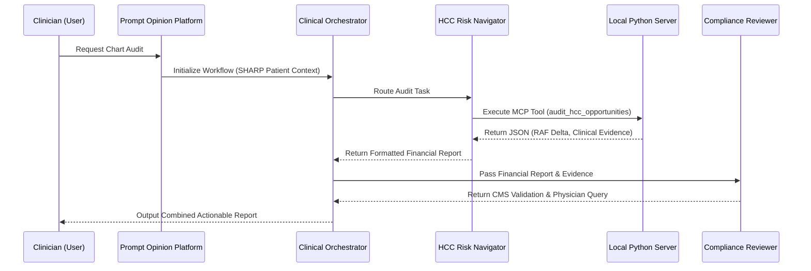

# Clinical Orchestrator: Multi-Agent HCC Revenue Capture

## Overview
Clinical documentation gaps result in significant revenue leakage for healthcare organizations. Often, physicians document symptoms and treatments in unstructured clinical notes but fail to append the corresponding Hierarchical Condition Category (HCC) ICD-10 codes to the active problem list. 

This project solves the "Last Mile" of clinical AI by deploying a multi-agent swarm to autonomously audit patient charts, identify missing revenue opportunities, validate clinical evidence against CMS compliance standards, and draft actionable physician queries.

## Architecture & Interoperability
This solution is built on the Prompt Opinion platform, heavily leveraging the Model Context Protocol (MCP) and Agent-to-Agent (A2A) communication standards. It utilizes a native Orchestrator to manage a zero-touch, deterministic workflow.

### The Agent Swarm
1. **Clinical Orchestrator (Native Engine):** Manages the execution pipeline. It receives the initial user prompt and routes data between sub-agents without requiring manual user intervention.
2. **HCC Risk Navigator (Sub-Agent):** Equipped with an MCP connection to a local Python/FastAPI backend. It queries the mock FHIR database to extract unstructured clinical notes, identifies coding gaps, and calculates current vs. projected RAF (Risk Adjustment Factor) scores.
3. **Compliance Reviewer (Sub-Agent):** An independent validation agent. It receives the proposed ICD-10 codes and clinical evidence from the HCC Navigator and strictly evaluates them against CMS MEAT (Monitor, Evaluate, Assess, Treat) documentation standards.

### System Flow
The following sequence diagram illustrates the A2A handoffs and MCP tool execution:



## Technical Implementation
- **Model Context Protocol (MCP):** The local database is exposed to the AI swarm via an MCP server written in Python (FastAPI).
- **SHARP Extension Specs:** The MCP server is configured to require patient data access. The platform natively handles the SHARP context propagation, ensuring the agents only query data for the active patient session, maintaining strict data boundaries.
- **A2A Interoperability:** The sub-agents operate independently. The Compliance Reviewer does not have access to the underlying FHIR database; it is strictly constrained to evaluate the text payload delivered by the HCC agent, simulating real-world departmental firewalls.

## Local Installation

### Prerequisites
- Python 3.10+
- ngrok (for exposing the local MCP server)
- Prompt Opinion Platform Account

### Setup Instructions

Clone the repository:
```bash
git clone https://github.com/vjb/FIRE.git
cd FIRE
```

Install dependencies:
```bash
python -m venv venv
venv\Scripts\activate   # Windows
# source venv/bin/activate # macOS/Linux

pip install -e ".[dev]"
playwright install chromium
```

Seed the local mock database:
```bash
python scripts/seed_db.py
```

Start the MCP server:
```bash
python src/server.py
```

In a separate terminal, expose the server using ngrok:
```bash
ngrok http 8000
```
Update your Prompt Opinion workspace configuration with the generated ngrok URL to establish the MCP connection.

## Usage
Within the Prompt Opinion workspace, select the active patient context and trigger the Clinical Orchestrator with the following prompt:
> *"I am prepping the chart for her annual wellness visit today. Please run an audit for missing revenue opportunities."*
