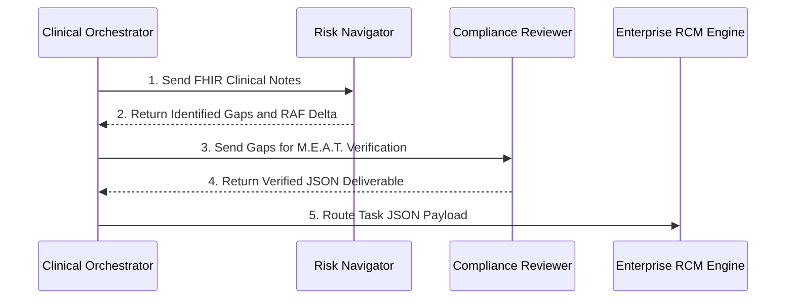

# FIRE: FHIR-Integrated Revenue Engine

## Executive Summary
Manual clinical chart reviews are error-prone and labor-intensive, resulting in millions of dollars of lost revenue due to undocumented Hierarchical Condition Category (HCC) gaps. **FIRE** is an autonomous multi-agent system that interfaces directly with FHIR R4 servers to seamlessly audit patient records, identify hidden conditions, verify them against CMS M.E.A.T. standards, and calculate precise revenue metrics.

## Market Analysis & Revenue Projections
To understand the financial scale of this technology, here is a highly conservative market analysis for deploying FIRE at a typical mid-sized regional hospital:

**Conservative Assumptions:**
* **Medicare Advantage Panel**: 10,000 patients.
* **Gap Prevalence**: Only 5% of patients (500) have an undocumented HCC gap buried in their unstructured clinical notes.
* **Average Gap Value**: A minor +0.200 RAF increase per gap (approx. $2,000/yr per patient).

**Hospital Financial Impact:**
* 500 patients × $2,000 = **$1,000,000 in recovered annual revenue**.
* Cost to hospital: $0 upfront. No new clinical documentation integrity (CDI) headcount required.

**FIRE Business Model (10% Shared Savings):**
* $1,000,000 × 10% = **$100,000 Annual Recurring Revenue (ARR)** for FIRE per hospital.
* Capturing just 10 mid-sized hospitals yields a $1M ARR SaaS business with near-zero marginal cost, as the deterministic multi-agent pipeline operates entirely autonomously.

## Architecture Overview
FIRE utilizes an MCP tool for deterministic FHIR data retrieval and orchestrates three distinct agents to execute the compliance and coding workflow.

### Technical Foundation
* **Prompt Opinion Integration:** The FIRE MCP Server and Agents are deployed live on the Prompt Opinion platform.
* **FHIR R4 Integration**: FIRE queries a public HAPI FHIR server. A test patient record is available here:
  * [View FHIR Patient Resource](https://hapi.fhir.org/baseR4/Patient/132026010)
  * [View FHIR Clinical Note (Base64 Encoded DocumentReference)](https://hapi.fhir.org/baseR4/DocumentReference?subject=Patient/132026010)
* **Cloud Deployment**: The MCP backend is deployed as a service on Render. The active endpoints are:
  * [Live MCP Server SSE Endpoint](https://fire-mcp-backend.onrender.com/mcp/sse)
  * [Interactive Swagger UI (/docs)](https://fire-mcp-backend.onrender.com/docs)
  * [OpenAPI Schema (/openapi.json)](https://fire-mcp-backend.onrender.com/openapi.json)
* **FastAPI and FastMCP**: Serves the `audit_v28_cohort` MCP tool.
* **SHARP Protocol Middleware and HTI-1 Interoperability**: Intercepts `X-FHIR-Server-URL` and authentication headers. FIRE adheres to the SHARP extension specifications and FHIR standards for EHR interoperability.

## Agent Topology
FIRE orchestrates three distinct agents in a sequential data-handoff topology:

1. **Clinical Orchestrator**: Executes the MCP tool `audit_v28_cohort` to fetch FHIR data. It functions as a data pipeline, managing the initial handoff to sub-agents and routing the final JSON payload to the enterprise RCM system (e.g., Jira, Epic).
2. **HCC Risk Navigator**: A sub-agent that cross-references `clinical_notes_text` against the CMS V28 HCC dictionary. It identifies documentation gaps and calculates the RAF delta. It queries a vectorstore containing the ICD-10 MS-DRG Version 43.1 guidelines to retrieve diagnostic codes.
3. **Compliance Reviewer**: A validation agent that acts as a compliance gatekeeper. It does not have direct database or FHIR access. It verifies that proposed codes meet CMS M.E.A.T. (Monitor, Evaluate, Assess, Treat) criteria based on the clinical notes. It utilizes a PubMed integration to cross-reference prescribed treatments against medical literature.



## Execution Pipeline
Note: This pipeline can be automated to schedule tasks in an enterprise workflow system. For demonstration purposes, it is executed sequentially to verify outputs.

### Step 1: Cohort Triage and Baseline Scorecard
The system calculates the current value of each patient's coded conditions and scans the FHIR records to identify patients with unreviewed clinical notes.

**Prompt:**
```text
Run a baseline audit on our newest FHIR patient cohort and show me the scorecard.
```


### Step 2: Risk Analysis
The Risk Navigator agent cross-references the retrieved clinical text against the CMS V28 dictionary to identify hidden coding gaps.

**Prompt:**
```text
Run the HCC gap analysis audit on all patients marked ready for audit and list them.
```


### Step 3: RAF Impact Calculation
The system calculates the exact cumulative Risk Adjustment Factor (RAF) delta across the cohort and projects the corresponding financial impact.

**Prompt:**
```text
so whats the total raf increase and revenue impact potential?
```


### Step 4: Compliance Verification
The Compliance Reviewer verifies the proposed diagnostic codes against CMS M.E.A.T. criteria using a native PubMed integration to validate treatment protocols.

**Prompt:**
```text
check with compliance
```


### Step 5: System Integration and Workflow Hand-Off
The Orchestrator generates a structured JSON payload containing the verified clinical data and compliance decisions for routing into the hospital's RCM engine.

**Prompt:**
```text
write the json to generate the task in epic in hcls format assign dates two days from now and assign to dr. smith
```

**JSON Output Payload:**
```json
[
  {
    "type": "Task",
    "title": "Add Diabetic Peripheral Neuropathy Code",
    "patientId": "132026010",
    "assignee": "Dr. Smith",
    "dueDate": "2023-11-05",
    "priority": "High",
    "details": {
      "clinicalEvidence": "Patient presents for routine follow up of type 2 diabetes. Assessment: Diabetic peripheral neuropathy.",
      "currentCode": "E11.9",
      "suggestedCode": "E11.40",
      "rafDelta": 0.198,
      "revenueImpact": "$1,980",
      "actionRequired": "Confirm the addition of ICD-10 code E11.40 for Diabetic Peripheral Neuropathy."
    }
  },
  {
    "type": "Task",
    "title": "Add COPD with Exacerbation Code",
    "patientId": "132026013",
    "assignee": "Dr. Smith",
    "dueDate": "2023-11-05",
    "priority": "High",
    "details": {
      "clinicalEvidence": "Assessment: Acute exacerbation of COPD.",
      "currentCode": null,
      "suggestedCode": "J44.1",
      "rafDelta": 0.335,
      "revenueImpact": "$3,350",
      "actionRequired": "Ensure ICD-10 code J44.1 is included on the active problem list."
    }
  },
  {
    "type": "Task",
    "title": "Add Stage 4 CKD Code",
    "patientId": "132026016",
    "assignee": "Dr. Smith",
    "dueDate": "2023-11-05",
    "priority": "High",
    "details": {
      "clinicalEvidence": "Assessment: Stage 4 chronic kidney disease. eGFR of 22 mL/min/1.73m2.",
      "currentCode": null,
      "suggestedCode": "N18.4",
      "rafDelta": 0.421,
      "revenueImpact": "$4,210",
      "actionRequired": "Confirm the inclusion of ICD-10 code N18.4 based on documented eGFR levels."
    }
  }
]
```

## Source Code & Prompts

| Component | Link / Proof |
|-----------|--------------|
| **Agent Configurations** | [View Agent System Prompts (`docs/prompts.md`)](docs/prompts.md) |
| **FastMCP Server and Auth** | [`src/server.py`](src/server.py)<br>**[Capability Injection (L413-L431)](src/server.py#L413-L431):** Extends FastMCP to register the `ai.promptopinion/fhir-context` capability. |
| **Baseline Calculator** | [`src/hcc_engine.py`](src/hcc_engine.py)<br>**[Raw Context Handoff (L180-L208)](src/hcc_engine.py#L180-L208):** Calculates the baseline and packages raw `clinical_notes_text` for the LLM agent. |

## Phase 2: The Ambient Revenue Engine (Continuous Integration)

FIRE is rapidly evolving from a retrospective audit tool into an invisible, ambient background process that autonomously secures hospital revenue. Our Phase 2 enterprise roadmap introduces the following scalable integrations:

1. **Live FHIR Event Subscriptions (Zero-Touch Auditing):** We are transitioning from interactive sequences to an event-driven webhook architecture. FIRE will subscribe to live FHIR `DocumentReference` creation events, autonomously auditing physician notes the exact second they are signed.
2. **Full-Chart Intelligence:** The underlying vectorstore will be expanded beyond CMS V28 to incorporate standard **CPT codes** (for automated E&M Leveling) and **SDOH Z-codes**. Additionally, we will integrate multi-tenant localized **Payer Contracts** (e.g., UHC vs. Humana rules) to preemptively stop specific claim denials before they happen.
3. **Closed-Loop EHR Write-Back:** Using SMART on FHIR, Phase 2 bypasses standard task managers entirely. FIRE will automatically `POST` verified Physician Queries directly into the doctor's native Epic "In Basket" or Cerner "Message Center" inbox. This embeds the AI seamlessly into the clinician's daily workflow without requiring them to log into a new dashboard.

## Glossary of Terms
Please refer to the [Glossary of Terms](docs/glossary.md) for definitions of acronyms and regulatory terminology used in this repository.
