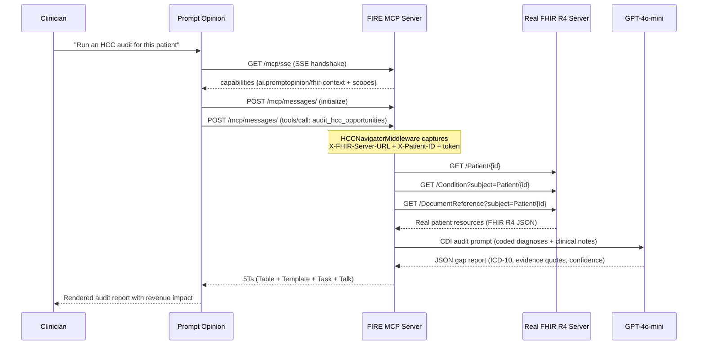

# 🔥 FIRE — FHIR-Integrated Revenue Engine

> **Agents Assemble Hackathon** · Prompt Opinion Platform · May 2026

FIRE is a production-grade MCP server that audits Medicare Advantage patient charts for **V28 HCC coding gaps** — conditions clinically documented in notes but missing from the coded problem list. Each uncaptured HCC code represents roughly **$10,000 in lost annual revenue** per patient. FIRE finds them, quantifies the loss, and generates the physician query to fix it.

> [!IMPORTANT]
> **FIRE runs against a real FHIR R4 server.** When deployed with Prompt Opinion, it fetches live patient data from Prompt Opinion's FHIR proxy using the SHARP context headers. For development, it falls back to the [HAPI FHIR public demo server](https://hapi.fhir.org/baseR4) (R4, 43,000+ real patients). The local SQLite mock exists **only for offline unit testing** — it is never used in production.

---

## The Problem

The CMS transition from HCC Model V24 → **V28** (completed 2026) made "unspecified" diagnosis codes like `E11.9` (Type 2 Diabetes, unspecified) worth **zero** in risk adjustment. Providers who coded correctly under V24 are now losing reimbursement unless their charts document the specificity that V28 demands — e.g., `E11.40` (T2DM with diabetic neuropathy). That specificity is often buried in the unstructured note. A physician wrote "bilateral burning and numbness in feet, started Gabapentin" — but never updated the problem list code. FIRE catches this.

Industry estimate: **$100,000–$500,000 in annual RAF revenue leakage** per 50-patient Medicare Advantage panel that hasn't been audited.

---

## What It Does

FIRE exposes **two MCP tools** to the Prompt Opinion platform:

### `audit_hcc_opportunities(patient_id)`
Single-patient chart audit. Given a FHIR patient ID:
1. Fetches the patient's **Conditions** and **DocumentReferences** from the real FHIR R4 server
2. Computes the current RAF score from the coded ICD-10 problem list (CMS HCC V28 model)
3. Sends the unstructured clinical notes to **GPT-4o-mini** with a CDI specialist system prompt
4. Identifies HCC coding gaps — conditions documented in notes but not on the problem list
5. Returns the **5Ts deliverable framework** (see below)

### `audit_v28_cohort(max_patients=5)`
Cohort-level sweep. Fetches up to N patients directly from the FHIR server, audits each, and returns a **cohort RAF Gap Scorecard** sorted by estimated revenue recovery. Designed for population health managers and RCM directors who need a daily gap report across their panel.

---

## The 5Ts Output Framework

Every audit returns four structured deliverables:

| Deliverable | What It Is |
|---|---|
| **Table** | Markdown RAF Gap Scorecard — ICD-10 gap, HCC code, confidence, RAF delta, estimated annual revenue impact in dollars |
| **Template** | Pre-filled physician query letter — compliant CDI query citing the evidence quote from the note, the suggested code, and the V28 rationale |
| **Task** | JSON RCM workflow ticket — priority, assignee, due date, gap summary — ready to POST to your task management system |
| **Talk** | Plain-English consultation summary — what the AI found, in language a CDI specialist can read in 10 seconds |

---

## Real FHIR Data — Primary Data Path

> [!NOTE]
> This section describes how FIRE fetches data in production. The mock database described in the testing section below is **not used here**.

When Prompt Opinion calls a FIRE MCP tool, it injects SHARP headers on every `POST /mcp/messages/` request:

```
X-FHIR-Server-URL:    https://app.promptopinion.ai/api/workspaces/{id}/fhir
X-FHIR-Access-Token:  eyJ...   (Bearer token for the FHIR proxy)
X-Patient-ID:         <fhir-patient-id>
X-FHIR-Refresh-Token: eyJ...   (when offline_access scope is granted)
X-FHIR-Refresh-Url:   https://app.promptopinion.ai/...
```

FIRE's `HCCNavigatorMiddleware` captures all five headers into a `ContextVar`. The tool then:

```
1. GET {fhir_url}/Patient/{patient_id}              → demographics
2. GET {fhir_url}/Condition?subject=Patient/{id}    → coded diagnoses (ICD-10)
3. GET {fhir_url}/DocumentReference?subject=...     → clinical notes (base64 decoded)
```

**Fallback chain (in order):**
1. Prompt Opinion FHIR proxy (production — sent via SHARP headers)
2. `https://hapi.fhir.org/baseR4` (development default)
3. Local SQLite mock EHR (offline unit testing only — never in production)

---

## Architecture

```
Prompt Opinion Platform (app.promptopinion.ai)
    │
    │  MCP/SSE (JSON-RPC over HTTP via ngrok)
    │  SHARP: X-FHIR-Server-URL, X-FHIR-Access-Token, X-Patient-ID
    ▼
┌─────────────────────────────────────────────────────┐
│  FIRE MCP Server  (FastAPI + FastMCP)               │
│                                                     │
│  HCCNavigatorMiddleware  ← pure ASGI (not          │
│  ├─ Agent identity logging    BaseHTTPMiddleware,   │
│  └─ All SHARP headers → ContextVar  SSE-safe)      │
│                                                     │
│  Tools                                              │
│  ├── audit_hcc_opportunities(patient_id)            │
│  └── audit_v28_cohort(max_patients)                 │
│                                                     │
│  _fetch_fhir_patient_context()                      │
│  ├── GET /Patient/{id}            ← real FHIR       │
│  ├── GET /Condition?subject=...   ← real FHIR       │
│  └── GET /DocumentReference?...   ← real FHIR       │
│                                                     │
│  audit_hcc_gaps()  ←  GPT-4o-mini CDI analysis     │
│  format_5ts()      ←  Table / Template / Task / Talk│
└─────────────────────────────────────────────────────┘
    │                              │
    │ FHIR R4 (Bearer auth)        │ Fallback only
    ▼                              ▼
Po FHIR Proxy               hapi.fhir.org/baseR4
(production)               (dev / test fallback)
```

### SHARP Protocol Compliance

| Spec Requirement | Implementation |
|---|---|
| `initialize` declares `ai.promptopinion/fhir-context` | ✅ monkey-patched `create_initialization_options` |
| Required FHIR scopes | ✅ `patient/Patient.rs`, `patient/Condition.rs`, `patient/DocumentReference.rs` |
| `offline_access` scope | ✅ declared — enables background cohort processing |
| All 5 SHARP headers captured | ✅ `HCCNavigatorMiddleware` (pure ASGI) |
| SSE streaming not broken by middleware | ✅ pure ASGI `__call__` — not `BaseHTTPMiddleware` |

---

## System Flow



---

## Project Structure

```
FIRE/
├── src/
│   ├── server.py          # FastAPI + FastMCP MCP server (main entry point)
│   ├── hcc_engine.py      # RAF calculator, LLM gap detector, 5Ts formatter
│   ├── models.py          # SQLAlchemy ORM (Patient, Condition, ClinicalNote)
│   └── database.py        # SQLite engine — used by mock EHR for unit tests only
├── scripts/
│   └── seed_db.py         # Seeds offline mock EHR for unit testing
├── tests/
│   ├── test_fhir_integration.py  # ← LIVE FHIR tests (hapi.fhir.org/baseR4)
│   ├── test_hcc_auditor.py       # Unit: RAF calc, LLM gap detection (mocked LLM)
│   ├── test_mcp_server.py        # Integration: REST endpoints + SSE round-trip
│   ├── test_seed_db.py           # DB: mock EHR seed integrity
│   └── test_wait_utils.py        # Async polling utilities
├── docs/
│   ├── promptopinion.md          # Prompt Opinion SHARP/A2A/MCP spec
│   └── hackathon_details.md      # Submission requirements
└── pyproject.toml
```

---

## Endpoints

| Method | Path | Description |
|---|---|---|
| `GET` | `/health` | Liveness check → `{"status": "ok"}` |
| `GET` | `/mcp/sse` | MCP SSE stream — Prompt Opinion connects here |
| `POST` | `/mcp/messages/` | MCP JSON-RPC bus — SHARP headers + tool calls arrive here |
| `POST` | `/tools/audit_hcc_opportunities` | REST wrapper for direct curl/testing |
| `GET` | `/docs` | FastAPI Swagger UI |

---

## Setup

### Prerequisites
- Python 3.11+
- OpenAI API key
- ngrok (to expose the local server to Prompt Opinion)

### Step 0: Environment Configuration

```env
# .env — required
OPENAI_API_KEY=sk-...

# Optional: LangSmith tracing
LANGCHAIN_API_KEY=...
LANGCHAIN_TRACING_V2=true
```

### Step 1: Install

```bash
git clone https://github.com/vjb/FIRE.git
cd FIRE
python -m venv venv
venv\Scripts\activate        # Windows
# source venv/bin/activate  # macOS/Linux
pip install -e ".[dev]"
```

### Step 2: Run the Server

```bash
python -m uvicorn src.server:app --host 0.0.0.0 --port 8000 --reload
```

The server starts and immediately targets real FHIR data via `https://hapi.fhir.org/baseR4`. No seeding required.

### Step 3: Expose via ngrok

```bash
ngrok http 8000
```

Copy the `https://` URL. In Prompt Opinion → **Configuration → MCP Servers** → paste `<ngrok-url>/mcp/sse`.

---

## Testing

### Unit + Integration tests (offline, no network required)

These tests use a seeded local SQLite mock EHR — they do **not** hit any FHIR server or make LLM calls.

```bash
# Seed the mock EHR first (one-time)
python scripts/seed_db.py

# Run all offline tests
pytest tests/ -v
```

Expected: **56/56 PASS**

| Test file | What it covers |
|---|---|
| `test_hcc_auditor.py` | RAF computation, LLM gap detection (mocked), output schema |
| `test_mcp_server.py` | REST endpoints, SSE transport, full JSON-RPC round-trip (live uvicorn subprocess) |
| `test_seed_db.py` | Mock EHR seed integrity — FHIR R4 JSON validity |
| `test_wait_utils.py` | Async polling utilities |

### Live FHIR Integration Tests (requires network)

> [!IMPORTANT]
> These tests hit the **real HAPI FHIR public server** at `https://hapi.fhir.org/baseR4`. They validate that the FIRE engine works correctly with actual FHIR R4 resources — the same code path that runs in production with Prompt Opinion's FHIR proxy.

```bash
pytest tests/test_fhir_integration.py -m live_fhir -v
```

| Test class | What it validates |
|---|---|
| `TestHAPIFHIRConnectivity` | Server reachable, R4 CapabilityStatement, Patient/Condition/DocumentReference endpoints available |
| `TestFHIRResourceStructure` | Patient resources have required fields, Condition resources reference correct subject, ICD-10/SNOMED codes present |
| `TestFetchFHIRPatientContext` | `_fetch_fhir_patient_context()` returns correct structure, marks `_source: fhir`, returns `None` for nonexistent patient |
| `TestHCCAuditOnRealFHIRData` | Full pipeline on real patient: FHIR fetch → RAF calc → GPT analysis → 5Ts formatting — all required keys present, RAF values numeric and valid |
| `TestCohortAuditRealFHIR` | Cohort patient ID sweep from FHIR, multi-patient audit loop with correct output structure |

**Run only connectivity checks (no LLM calls):**
```bash
pytest tests/test_fhir_integration.py -m live_fhir -v -k "Connectivity or FHIRResourceStructure or FetchFHIR"
```

**Run full pipeline including LLM (requires `OPENAI_API_KEY`):**
```bash
pytest tests/test_fhir_integration.py -m live_fhir -v
```

---

## CMS HCC V28 Reference

The engine uses a hardcoded subset of the CMS V28 RAF weight table:

| ICD-10 | HCC | Condition | RAF Weight |
|---|---|---|---|
| `E11.9` | 19 | T2DM without complications | 0.104 |
| `E11.40` | 18 | T2DM with diabetic neuropathy | **0.302** |
| `I50.9` | 85 | Heart failure, unspecified | 0.331 |
| `N18.3` | 137 | CKD Stage 3 | 0.289 |
| `N18.4` | 136 | CKD Stage 4 | 0.421 |
| `J44.1` | 111 | COPD with exacerbation | 0.335 |
| `F32.9` | 59 | Major depressive disorder | 0.309 |
| `G40.909` | 79 | Epilepsy, unspecified | 0.612 |

Revenue estimate: **$10,000 per RAF point** (industry standard for Medicare Advantage plans).

---

## Hackathon Submission

- **Competition**: Prompt Opinion "Agents Assemble" Hackathon
- **Deadline**: May 11, 2026
- **Platform**: [app.promptopinion.ai](https://app.promptopinion.ai)
- **Category**: Healthcare AI / Revenue Cycle Management
- **Key differentiator**: First MCP server to implement the full Prompt Opinion SHARP Extension spec with live FHIR R4 server integration and V28-specific revenue gap quantification
